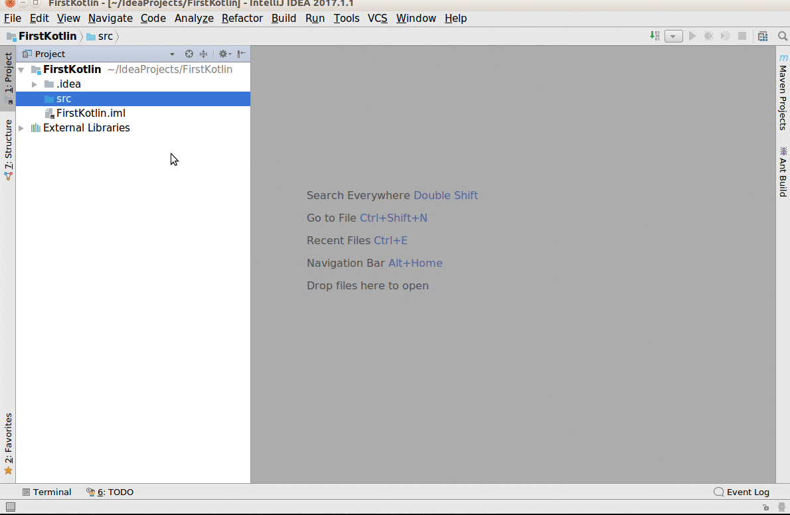

# FirstKotlin
kotlin을 공부하기 위해 만든 예제소스입니다. 프로그래밍 공부를 가장 효율적으로 하는 방법은 기본예제들을 단순하게 정리하고 새로운 환경에서 똑같이 만들어 보는 것입니다. IntelliJ에서 Kotlin을 기능별로 소스를 만들어 계속 업데이트 할 것입니다.
참고로 공부하며 정리하는 것이라 오류가 있을 수도 있습니다. [예제설명(doc 폴더)](doc/)

> **프로그래밍 입문자를 위해서 한글(변수,함수,클래스)을 사용합니다**

현업개발에서는 *절대로 문자열 외의 다른 것들을
한글로 만들지 않습*니다.

[Kotlin 공식페이지](https://kotlinlang.org/)
에서 레퍼런스를 참고합니다.

Contents:
---------
기본예제
- [시작하기](doc/1.First.md)
- [변수](doc/2.variable.kt.md)
- [변수와 Null처리](doc/3.variable_null.md)
- [숫자형 DataType](doc/4.DataTypeNumber.md)
- [범위](doc/5.scope.md)
- [문자열](doc/6.DataType_string.md)
- [기본함수](doc/7.basicfunction.md)
- [Any Type](doc/8.any_type.md)
- [제어문](doc/9.condition.md)
- [레이블과 이동](doc/10.loop_exit.md)
- [컬렉션](doc/11.collections.md)
- [예외처리](doc/18.trycatch.md)

객체지향
- [class와 상속](doc/12.class.md)
- [오버로딩, 오버라이딩](doc/13.polymorphism.md)
- [interface, abstract, static](doc/14.interface_abstract_static.md)

함수지향
- [람다식](doc/15.lambdas.md)
- [중요함수](doc/16.newstyle_function.md)
- [확장함수](doc/17.functionextension.md)

java
- [java클래스 가져오기 ](doc/19.javaimport.md)

무조건 코딩
------
> 프로그래밍은 눈으로 보면 안됩니다.

> 가능하다면 생각없이 무조건 실행부터 하는 것이 좋습니다.

> 공부는 자신이 만들면서 해야 내것이 됩니다.  머릿 속에 가득한 **남의 지식**은 금방 사라집니다.

