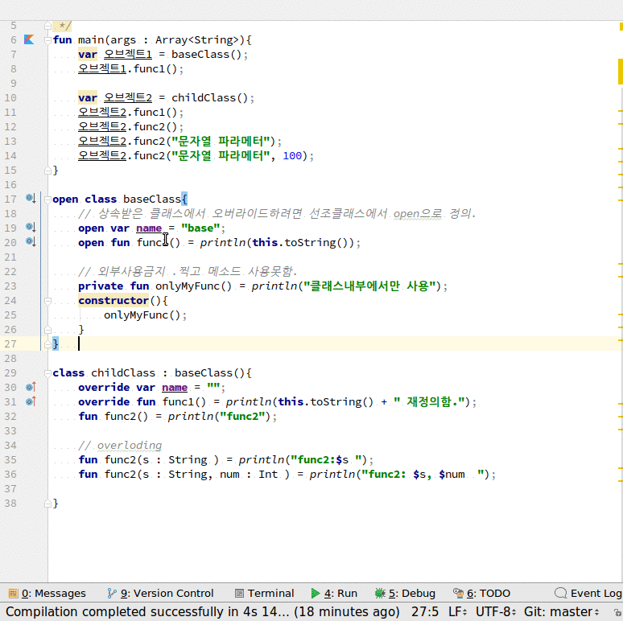

# class 기본 -2 오버로딩 & 오버라이딩
1. 선조 클래스에서 메소드와 필드를 **open**으로 정의한다.
2. 상속받은 클래스에서  **override**로 정의한다.
3. 오버로딩은 자바와 같다. 같은 이름의 다른 파라메터를 받는 메소드를 정의하면 된다.

## 전체소스
~~~kotlin
fun main(args : Array<String>){
    var 오브젝트1 = baseClass();
    오브젝트1.func1();

    var 오브젝트2 = childClass();
    오브젝트2.func1();
    오브젝트2.func2();
    오브젝트2.func2("문자열 파라메터");
    오브젝트2.func2("문자열 파라메터", 100);
}

open class baseClass{
    // 상속받은 클래스에서 오버라이드하려면 선조클래스에서 open으로 정의.
    open var name = "base";
    open fun func1() = println(this.toString());

    // 외부사용금지 .찍고 메소드 사용못함.
    private fun onlyMyFunc() = println("클래스내부에서만 사용");
    constructor(){
        onlyMyFunc();
    }
}

class childClass : baseClass(){
    override var name = "";
    override fun func1() = println(this.toString() + " 재정의함.");
    fun func2() = println("func2");

    // overloding
    fun func2(s : String ) = println("func2:$s ");
    fun func2(s : String, num : Int ) = println("func2: $s, $num  ");

}
~~~

