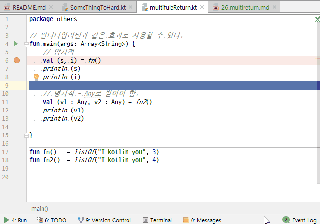

# multi type return...
1. 공식적으로는 지원하지 않는 듯하다.
2. 그런데 변수선언을 멀티타입처럼 사용하여 대입받을 수 있다.
3. List나 Pair같은 collection을 이용하면 된다.

## 전체소스 - kotlin
~~~kotlin

// 멀티타입리턴과 같은 효과로 사용할 수 있다.
fun main(args: Array<String>) {
    // 암시적
    val (s, i) = fn()
    println (s)
    println (i)

    // 명시적 - Any로 받아야 함.
    val (v1 : Any, v2 : Any) = fn2()
    println (v1)
    println (v2)

}

fun fn()   = listOf("I kotlin you", 3)
fun fn2()  = listOf("I kotlin you", 4)
~~~

