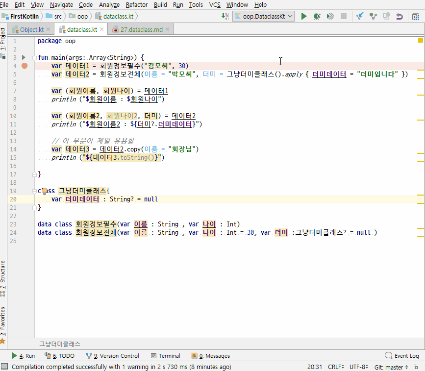

# data class
1. 일반클래스와 유사하지만, data 처리하기 위해 특화된 클래스
2. () 안에 필드들을 정의할 수 있다. {}안에서도 프로퍼티를 정의할 수도 있다.
3. data 클래스도 멀티리턴처럼 보일 수 있다(Destructuring Declarations)
4. 가장 유용한 것은 copy() 함수이다. 사용하다보면 정말 편하다.

## 전체소스 - kotlin
~~~kotlin

fun main(args: Array<String>) {
    var 데이터1 = 회원정보필수("김모씨", 30)
    var 데이터2 = 회원정보전체(이름 = "박모씨", 더미 = 그냥더미클래스().apply { 더미데이터 = "더미입니다" })

    var (회원이름, 회원나이) = 데이터1
    println ("$회원이름 : $회원나이")

    var (회원이름2, 회원나이2, 더미) = 데이터2
    println ("$회원이름2 : ${더미?.더미데이터}")

    // 이 부분이 제일 유용함
    var 데이터3 = 데이터2.copy(이름 = "회장님")
    println ("${데이터3.toString()}")

}

class 그냥더미클래스{
    var 더미데이터 : String? = null
}

data class 회원정보필수(var 이름 : String , var 나이 : Int)
data class 회원정보전체(var 이름 : String , var 나이 : Int = 30, var 더미 :그냥더미클래스? = null )

~~~

