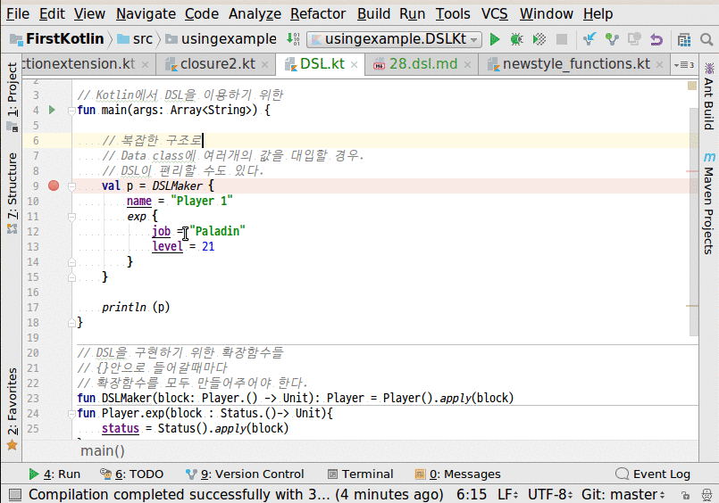

# dsl
1. 애플리케이션에서 언어비슷하게 쓰는 스크립트 형태를 DSL이라고 한다.
2. data class로 선언된 내용을 {}를 중첩하여 편리하게 대입시킬 수 있다.
3. 확장함수를 사용한다.
4. 클래스내에 클래스를 사용할 떄마다 확장함수로 정의해야 한다.

## 전체소스 - kotlin
~~~kotlin

// Kotlin에서 DSL을 이용하기 위한
fun main(args: Array<String>) {

    // 복잡한 구조로
    // Data class에 여러개의 값을 대입할 경우.
    // DSL이 편리할 수도 있다.
    val p = DSLMaker {
        name = "Player 1"
        exp {
            job = "Paladin"
            level = 21
        }
    }

    println (p)
}

// DSL을 구현하기 위한 확장함수들
// {}안으로 들어갈때마다
// 확장함수를 모두 만들어주어야 한다.
fun DSLMaker(block: Player.() -> Unit): Player = Player().apply(block)
fun Player.exp(block : Status.()-> Unit){
    status = Status().apply(block)
}

// data class
data class Player(var name:   String? = null,
                  var status: Status?    = null)
data class Status(var job: String? = null, var level: Int? = null)

~~~

